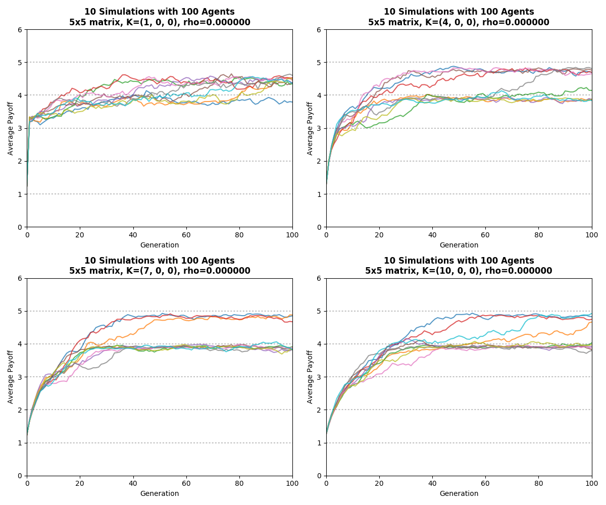
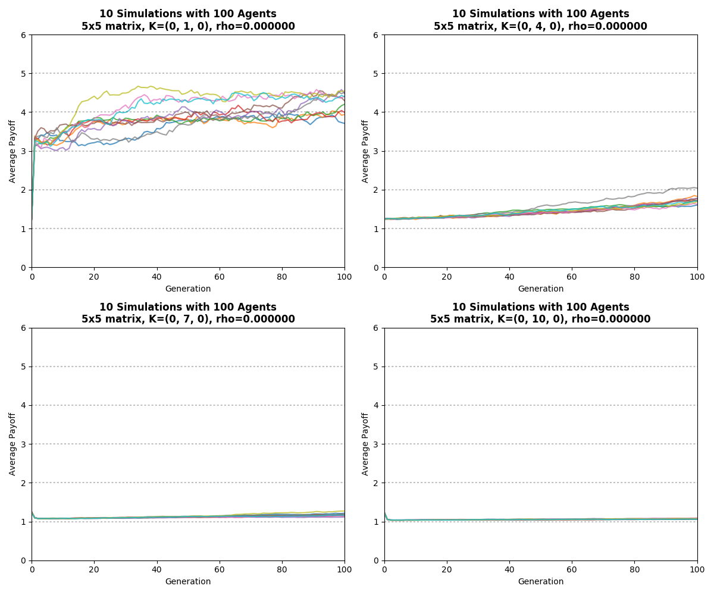
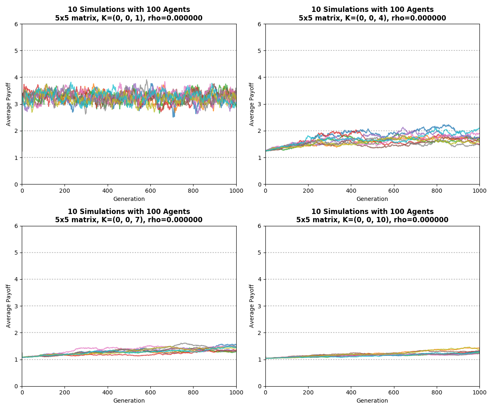
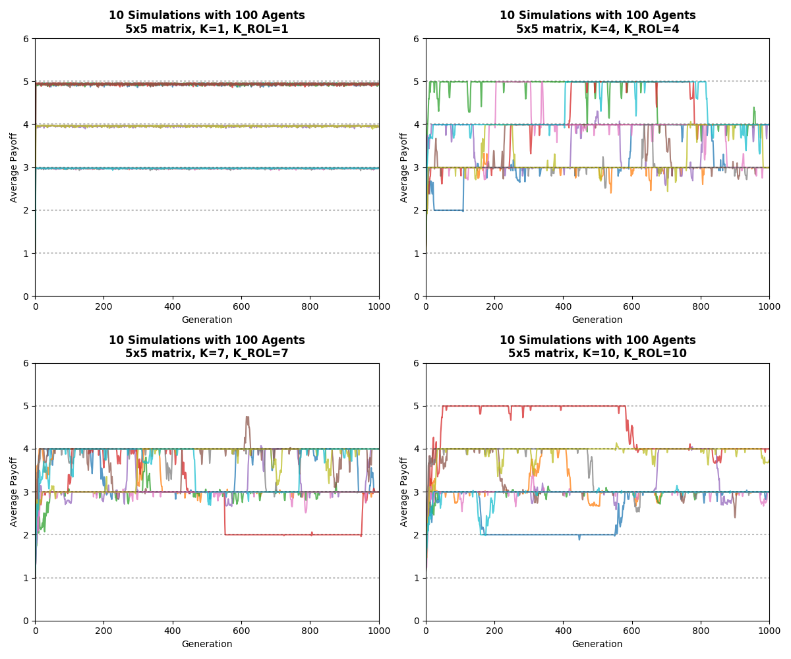

# Simulation Output

- Implementation: [Link](https://github.com/PluVian/elg-python/tree/master/elg)

## Parental Learning

- Test code: [Link](https://github.com/PluVian/elg-python/blob/master/tools/model_parental.py)

## Role Model Learning

- Test code: [Link](https://github.com/PluVian/elg-python/blob/master/tools/model_rolemodel.py)

## Random Learning

- Test code: [Link](https://github.com/PluVian/elg-python/blob/master/tools/model_random.py)

# Misc.

## Result of Another Implementation

The code is on [the link](https://github.com/PluVian/elg-python/blob/master/misc/np_evol_role_renew.py).

### Role Model Learning

